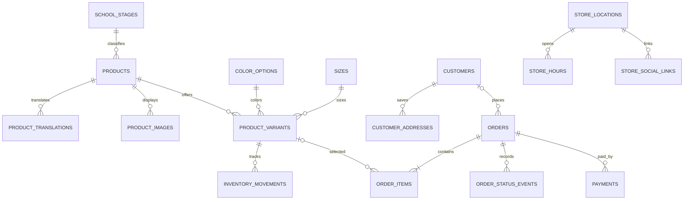

# POSHRAW.Co Database

The schema targets PostgreSQL 14 or newer. It is normalized around catalog products and purchasable variants, with bilingual product content, inventory tracking, customer records, order snapshots, payment records, and store contact details.

## Setup

For local development, run `npm run dev`. This starts the Vite storefront and Express catalog API; the embedded PostgreSQL database initializes from the schema and seed on first run and persists under `data/poshraw/`. No PostgreSQL service is required. The data directory is ignored by Git.

For a standalone PostgreSQL database, apply the schema from the project root:

```powershell
psql -h localhost -U postgres -d poshraw -v ON_ERROR_STOP=1 -f database/schema.sql
```

Only for development or demo environments, load the sample seed:

```powershell
psql -h localhost -U postgres -d poshraw -v ON_ERROR_STOP=1 -f database/seed.sql
```

The sample seed is safe to rerun. It creates 12 demo catalog products, 24 English/Sorani translations, 4 color options, 5 sizes, 240 color-size variants, and the Sulaymaniyah store record. Do not run it in production; enter approved POSHRAW products and prices instead. Demo product prices and inventory are intentionally unset. A `NULL` `stock_on_hand` with `track_inventory = false` means stock is not being tracked; it does not mean zero stock.

## Catalog API

- `GET /api/health` verifies that the API can query the database.
- `GET /api/catalog?locale=ckb` returns Sorani labels; use `locale=en` for English.
- `POST /api/orders` records customer contact/consent, pickup or delivery choice, item snapshots, and server-calculated totals. It accepts `items: [{ variantId, quantity }]`; client-supplied prices are never trusted.
- The catalog response includes stages, active colors, sizes, translated products, card images, and each active product variant with its SKU, effective price, inventory tracking flag, and stock count.
- Customers choose a size but not a color in the storefront. For the chosen size, the order uses the first in-stock color in the catalog's color order; the assigned color is displayed before order submission.
- Unpriced variants return `priceMinor: null`. Untracked stock returns `stockOnHand: null` and `trackInventory: false`.
- Orders with unconfigured product prices or unconfirmed delivery fees are saved with nullable totals for staff confirmation. Tracked inventory is reserved in the same transaction; cancellation releases remaining reservations.
- In development, Vite proxies `/api` to Express on port 3001. In production, run `npm run build` followed by `npm start`.

## Admin Setup

1. Copy `.env.example` to `.env` and replace `POSHRAW_ADMIN_SETUP_TOKEN` with a long, unique secret. Keep `.env` private.
2. Run `npm run dev` and open `/admin`.
3. Use the setup token once to create the owner email and password. Passwords must be at least 12 characters.
4. Remove `POSHRAW_ADMIN_SETUP_TOKEN` from `.env` and restart. Existing admins can still sign in; the one-time setup endpoint becomes unavailable.

Admin passwords are scrypt-hashed. Login sessions use random, revocable, HTTP-only, SameSite cookies and expire after eight hours. Admin write endpoints require an allowed same-origin request. The dashboard can edit bilingual product details, archive products, replace HTTPS photo URLs, set product/variant prices, enable stock tracking, adjust stock, and update order status. Inventory changes are recorded in `inventory_movements`; order status changes are recorded in `order_status_events` with the acting admin.

PGlite runs as a single embedded PostgreSQL connection, suitable for a single-instance local catalog. For a horizontally scaled production deployment, point a server-side API at managed PostgreSQL and keep the same schema; do not share the local `data/poshraw/` directory between instances.

## Production Deployment

1. Create a managed PostgreSQL 14+ database and keep its connection URL in your hosting provider's secret manager as `DATABASE_URL`. Never commit it or expose it as a `VITE_*` variable.
2. Apply `database/schema.sql` to the production database. Add real catalog data from an approved source; production startup intentionally does not insert the demo seed.
3. Set `DATABASE_SSL=require`, `POSHRAW_ALLOWED_ORIGINS=https://poshraw.com,https://www.poshraw.com`, `POSHRAW_ADMIN_SETUP_TOKEN` to a unique random value of at least 32 bytes for first-admin setup, and `TRUST_PROXY_HOPS` to the number of trusted HTTPS proxy hops.
4. Terminate TLS at a trusted reverse proxy and configure it to send `X-Forwarded-Proto: https`. The API rejects production requests it does not consider secure. Bind the API to loopback behind a same-host proxy, or set `API_HOST=0.0.0.0` only when network/firewall rules restrict direct access.
5. Run `npm run build`, then `npm start`. Create the first admin at `/admin`, remove the bootstrap token from the secret configuration, and restart. Existing admin accounts remain usable after the token is removed.

Use your managed database provider's encrypted automated backups where available. For an additional manual PowerShell backup, provide connection details through the standard libpq environment and a protected password file (or enter the password at the prompt); do not pass a credential-bearing connection URL as a command-line argument:

```powershell
$env:PGHOST = "your-database-host"
$env:PGPORT = "5432"
$env:PGDATABASE = "poshraw"
$env:PGUSER = "your-database-user"
$env:PGPASSFILE = "$env:APPDATA\postgresql\pgpass.conf"
$backupFile = "poshraw-$(Get-Date -Format yyyyMMdd-HHmmss).dump"
pg_dump --format=custom --no-owner --dbname=poshraw --file=$backupFile
```

Restore into a staging database first, never over production, then verify product, order, admin-login, and inventory records before promoting the restore. Set a retention policy and test restores regularly; a backup that has never been restored is unverified.

The PostgreSQL pool uses TLS certificate verification in production, and the server does not log the connection URL. If your provider requires a private CA, configure the Node.js trust store with that provider's CA certificate rather than disabling verification.

## Entity Map



## Table Responsibilities

- `school_stages`: stable stage identifiers and English/Sorani labels.
- `products`: canonical SKU, URL slug, stage, publication status, currency, and optional base price. Archive instead of deleting products that appear in orders.
- `product_translations`: localized product names, short and long descriptions, material, and care instructions.
- `product_images`: ordered card/gallery/detail image URLs and accessible alt text.
- `color_options`, `sizes`: reusable option dictionaries with display order.
- `product_variants`: one row per product-color-size combination, optional variant pricing, active state, and inventory tracking.
- `inventory_movements`: append-only stock changes. Update tracked stock and insert its movement in the same transaction.
- `customers`, `customer_addresses`: reusable customer/contact records and delivery addresses. Order address/contact snapshots preserve what was submitted at checkout.
- `admin_users`, `admin_sessions`: scrypt password hashes and expiring, revocable admin sessions. Raw session tokens are only sent in HTTP-only cookies; the database stores their SHA-256 hashes.
- `orders`, `order_items`: order lifecycle and immutable product/variant/name/price snapshots, so later catalog edits do not rewrite past orders.
- `order_status_events`: audit trail for every order status transition, including shipped delivery orders.
- `email_notification_outbox`, `whatsapp_notification_outbox`: transactional, retryable customer messages; WhatsApp is queued only when per-order consent was recorded.
- `payments`: provider transaction references and idempotency keys, ready for a payment provider when one is selected.
- `store_locations`, `store_hours`, `store_social_links`: store address, verified operating hours, and contact/social links. Phone, WhatsApp number, and hours remain unset until confirmed.

## Safe Order And Inventory Writes

Create an order and its items in one transaction. When inventory tracking is enabled, lock each selected variant with `SELECT ... FOR UPDATE`, check stock, insert the order items and inventory movement, and update `stock_on_hand` before committing. Use a unique payment idempotency key to avoid duplicate payment records. Keep database credentials on the server; never expose them in Vite client variables.

The storefront reads its catalog and submits order requests through the API. The admin dashboard can adjust catalog/inventory records and update order status. Email and consent-based WhatsApp notifications cover order receipt, order-status changes, and refunds; WhatsApp uses approved Meta Cloud API templates. Delivery orders can be marked shipped, while pickup orders can be marked ready. Payment gateway capture is not implemented; staff record cash or bank-transfer payments, and the store must confirm quote orders and payment directly with the customer.